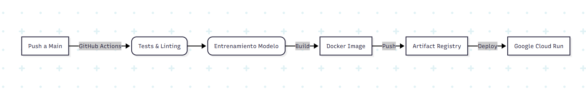

# 🏠 MLOps Challenge - House Price Prediction API


Solución profesional para el desafío técnico de MLOps, implementando una API RESTful para la predicción de precios de viviendas en King County (USA).

Este proyecto va más allá de la experimentación en notebooks, enfocándose en la **productivización**, **automatización** y **escalabilidad** del modelo.

---

## 🏗️ Arquitectura y Flujo MLOps

El proyecto sigue un pipeline de CI/CD automatizado utilizando GitHub Actions y Google Cloud Platform:



# Descripcion

Este proyecto es una implementación de un modelo de Machine Learning para predecir precios de viviendas utilizando el dataset "kc_house_data.csv". El modelo se entrena con una Regresión Lineal Simple y se expone a través de una API RESTful construida con FastAPI. El proyecto está diseñado para ser desplegado en Google Cloud Run, utilizando Docker para la contenedorización y DVC para el versionado de datos.

## 🛠️ Stack Tecnológico

Lenguaje: Python 3.11 (Slim version para optimizar imágenes).

API Framework: FastAPI (Validación de datos nativa con Pydantic).

Machine Learning: Scikit-Learn (Linear Regression Simple).

Contenedores: Docker (Multi-stage builds & Rootless security).

Infraestructura: Google Cloud Run + Artifact Registry.

CI/CD: GitHub Actions.

Gobierno de Datos: DVC (Data Version Control) implementado para trazabilidad.

### 📋 Estructura del Proyecto

La estructura está diseñada para separar responsabilidades entre entrenamiento, inferencia y configuración.

```plaintext
├── .github/workflows/  # Pipelines de CI/CD
├── src/
|   ├── data/           # Datasets (Trackeados con DVC)
│   ├── app.py          # API (FastAPI) - Punto de entrada de Inferencia
│   ├── train.py        # Script de entrenamiento (Genera el .pkl)
│   ├── predict.py      # Script para inferencia Batch
│   └── __init__.py
├── models/             # Artefactos del modelo serializados (.pkl)
├── tests/              # Tests unitarios y de integración
├── Dockerfile          # Definición del contenedor productivo
├── requirements.txt    # Dependencias congeladas
└── README.md           # Documentación
```

---

### 🚀 Guía de Ejecución Local

Sigue estos pasos para levantar el proyecto en tu máquina.

1. Prerrequisitos

   - Python 3.11
   - Git

2. Instalación de Dependencias

```bash
# Clonar el repositorio
git clone <URL_DEL_REPO>
cd <NOMBRE_DEL_REPO>
```

3. Crear entorno virtual (opcional pero recomendado)

```python
python -m venv venv
source venv/bin/activate  # En Windows: venv\Scripts\activate

# Instalar librerías
pip install -r requirements.txt
```

4. Entrenar el Modelo
Este script procesa el dataset kc_house_data.csv, entrena una Regresión Lineal y guarda el artefacto en models/model.pkl.

```bash
python src/train.py
```

 Output esperado: ✅ Modelo guardado exitosamente en: models/model.pkl

5. Levantar la API
    Inicia el servidor de desarrollo local.

La API estará disponible en: http://127.0.0.1:8000

---

### 🐳 Ejecución con Docker

Para simular el entorno productivo exacto, utiliza Docker.

```bash
# Construir la imagen (esto también entrena el modelo internamente)
docker build -t house-price-predictor .

# Ejecutar el contenedor en el puerto 8080
docker run -p 8080:8080 house-price-predictor
```
---

### 🧪 Testing y Calidad

El proyecto incluye tests automatizados para validar tanto la disponibilidad de la API como la integridad del modelo.

```bash
# Ejecutar suite de tests
pytest -v
```
---

### ☁️ Despliegue en Producción

La aplicación se encuentra desplegada y operativa en Google Cloud Run.

- URL del Servicio: https://mlops-meli-1091336880261.us-south1.run.app/

- Documentación Interactiva (Swagger): https://mlops-meli-1091336880261.us-south1.run.app/docs

Puedes probar el endpoint /predict enviando el siguiente JSON mediante una solicitud POST con el siguiente cuerpo:

```json
{
  "bedrooms": 3,
  "bathrooms": 2.5,
  "sqft_living": 2000,
  "sqft_lot": 5000,
  "floors": 1.5,
  "waterfront": 0,
  "view": 0
}
```

### 🛡️Notas de Seguridad y MLOps

- DVC: Se utiliza DVC para el versionado de datos. Nota: Para facilitar la evaluación de este challenge, el dataset .csv se ha incluido en el repositorio git, aunque en un entorno real residiría exclusivamente en un bucket de almacenamiento.

- Secretos: Las credenciales de GCP se gestionan mediante GitHub Secrets y no están expuestas en el código.

- Usuario no-root: El Dockerfile configura un usuario appuser para mitigar riesgos de seguridad en el contenedor.

### Autor: Lucas Leonetti
